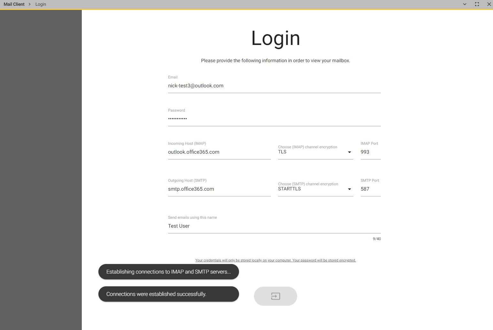
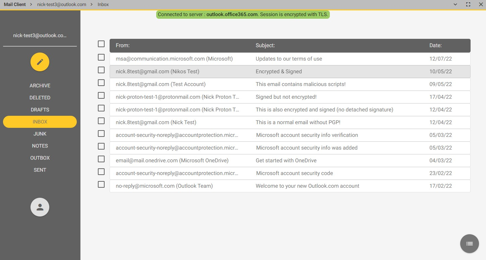
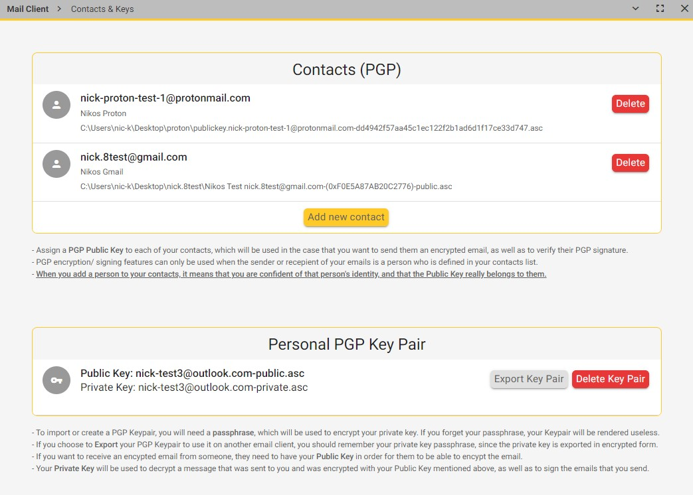
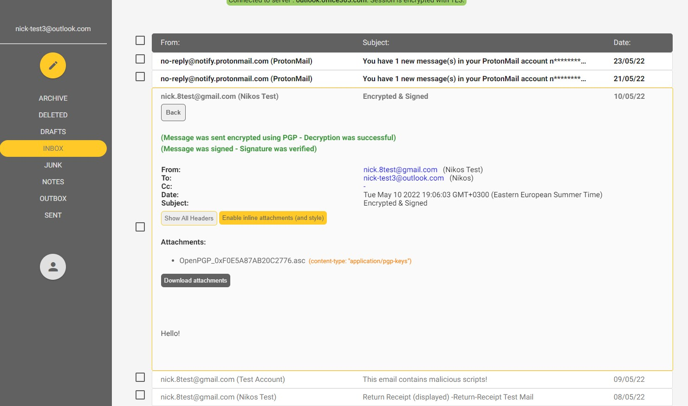
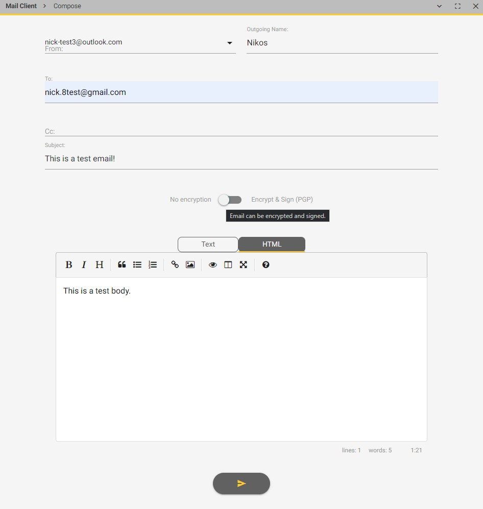

# **UP-Mail**
An open-source email client with built-in privacy features and OpenPGP functionality.

## Installation Guide
1. Requires Node.js (you can download at <https://nodejs.org/en/download/>)
2. Navigate to the application folder 
3. Install dependancies:  
   `npm install`
4. Run the app:            
   `npm start`

## Login to your (existing) email account
Steps depend on email provider. Steps for a few common providers are provided below:

### Microsoft (Outlook, Hotmail, WindowsLive)
Simply use your username (email address) and password.

### Google (Gmail)
Since May 2022, Google has disabled PLAIN Authentication (username & password) for third party applications.
As a result, the current version of this app **cannot login to Gmail**.

### Yahoo 
A new password must be created to be used only with the present client.
Navigate to your Yahoo Account and:
1. Select '**Add or Manage Accounts**'
2. Select 'Account Info' and then the '**Account Security**' tab.
3. From the available options, select the '**Other ways to sign in**' one.
4. Select '**Generate App Password**'
5. When you are asked for the App Name, use the name `up-mail` and then press Generate App Password
6. The above password can be used to login ONLY to this client using your regular username (email address)

## Logs
Each time the app is used, a new log file is produced, which contains the console output.
Location of log files: `C:\Users\<user>\AppData\Roaming\email-client\logs`.

## App screenshots

Login Page

Main Page

Contacts & Keys

Open Encrypted / Signed Message

Compose Window

